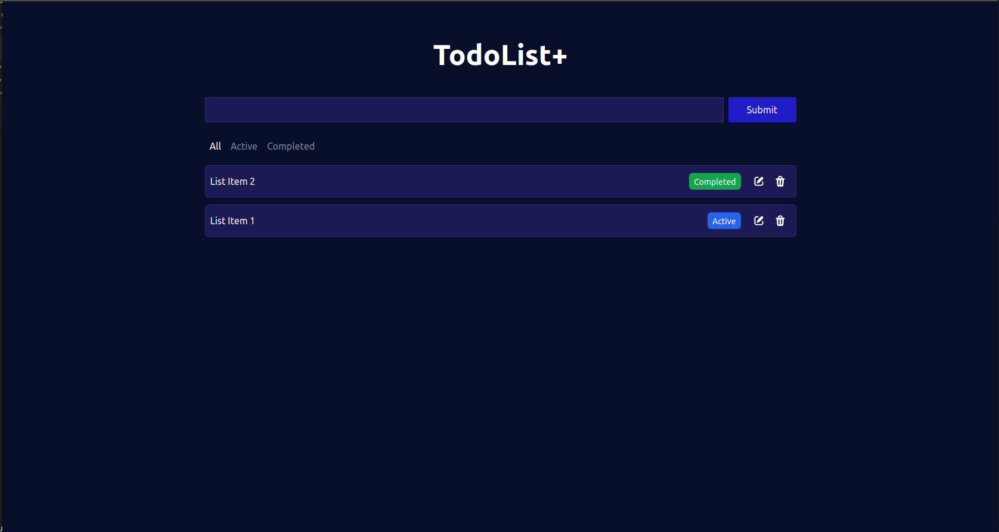

https://redux-react-todo-app.netlify.app/

# Todo Application

This project is a Todo application developed using React, Redux, Tailwind CSS, and AutoAnimate.

## Technologies Used

- **React**: A JavaScript library for building user interfaces.
- **Redux**: A predictable state container for JavaScript apps.
- **Tailwind CSS**: A utility-first CSS framework for rapid UI development.
- **AutoAnimate**: Used for creating smooth animations in the application.

